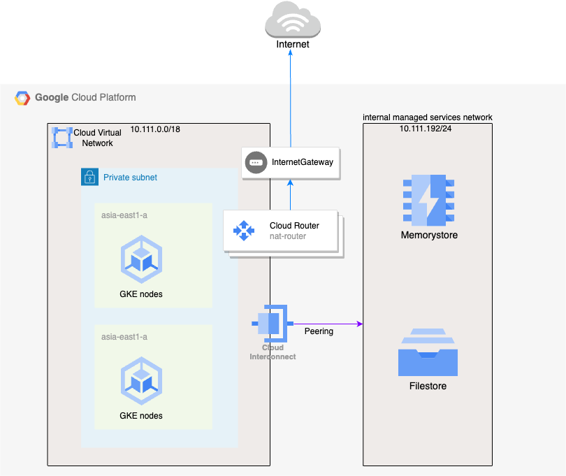
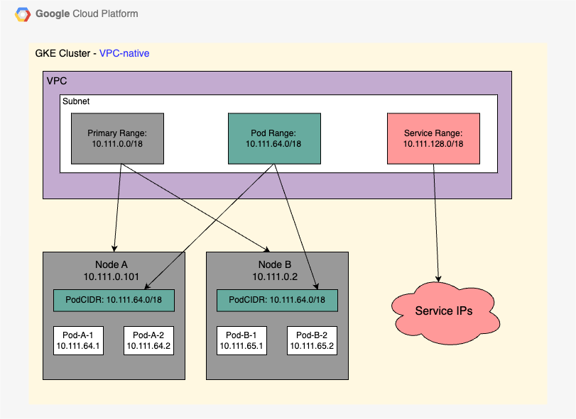

# How to provision an GCP GKE cluster using Terraform

To ensure Kubernetes best practices for building infrastructure, we use Terraform to manage the entire lifecycle of infrastruture with IaC.
In this guide, you will deploy the below list on GCP:
* 1 VPC `test-network`
* 1 subnet with 1 primary CIDR range`10.111.0.0/18` and 2 secondary CIDR ranges`10.111.64.0/18` `10.111.128.0/18`
* 1 reserved IP range`10.111.192.0/24` from test-network for **VPC_PEERING** `internal-managed-services`
* 2 Cloud NAT Routers `High Availability`
* Firewall rules
* 1 Filestore
* 1 Memorystore
* 1 GKE

The architecture will be the below pictures.



## [Optional] Enable GCP APIs
This will be used to deploy by Jenkins.
```
gcloud services enable cloudresourcemanager.googleapis.com --project your_project_id
```

## Provision Infrastructure
Update the configurations`gke.tfvars` based on your personal requirements.

Let's get started with Terraform to build a GKE Cluster.
```
terraform init
terraform plan -var-file gke.tfvars
terraform apply -var-file gke.tfvars
```

## Connecting to the GKE
Now that your cluster is provisioned, use gcloud to retrieve the cluster configuration for `kubectl`.
```
gcloud container clusters get-credentials devops-demo-gke --region asia-east1
```

## Testing
Verify `kubectl` with the command below:
```
kubectl get svc
```

## Cleanup
To destroy previously-created infrastructure with Terraform, run the command below:
```
terraform destroy -var-file gke.tfvars
```
